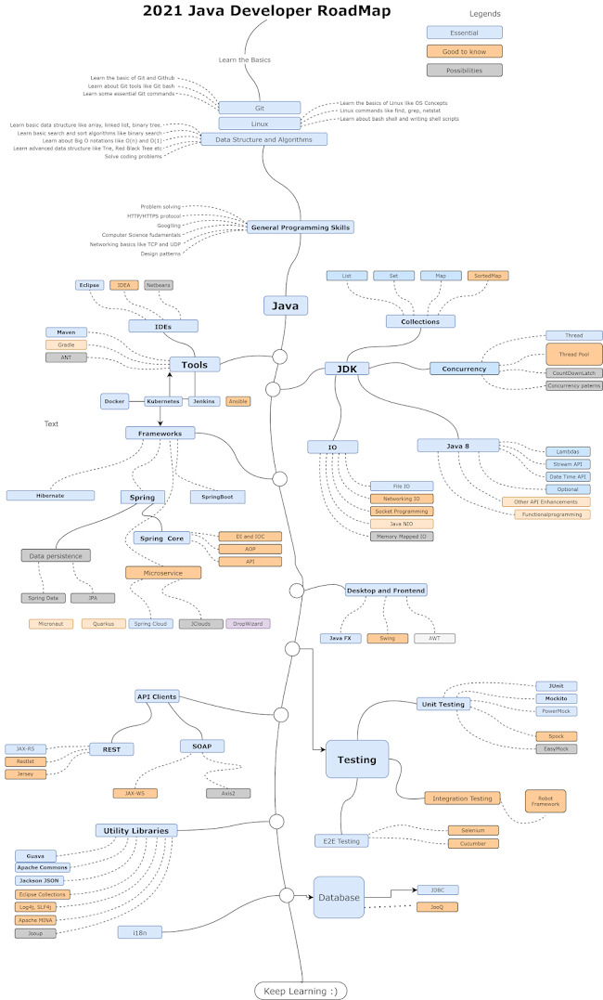

# Self-taught Java

## 2021 learning book
1. [Java in a Nutshell](https://www.oreilly.com/library/view/java-in-a/9781492037248/)
2. [Effective Java](https://github.com/muhdkhokhar/test/blob/master/Joshua%20Bloch%20-%20Effective%20Java%20(3rd)%20-%202018.pdf)

## 2021 learning road map
[Source](https://javarevisited.blogspot.com/2019/10/the-java-developer-roadmap.html#axzz6trOECQBz)

### JVM
JVM is a program that provides the runtime environment necessary for Java programs to execute. Java programs cannot run unless there is a JVM available for the appropriate hardware and OS platform we wish to execute on.
- When JVM takes in a Java program for execution, the program is not provided as Java language source code. Instead, the Java language source must have been converted into Java bytecode.
- The JVM is an interpreter for the bytecode form.
_Bytecode is not machine code, it's a halfway house between source code and machine code_

