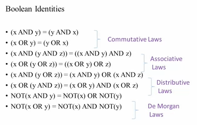
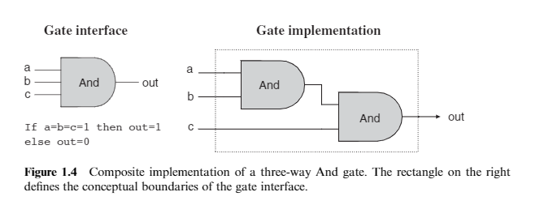
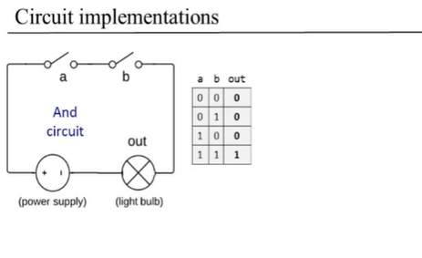
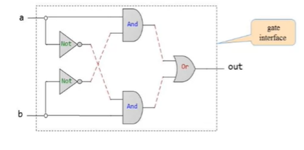
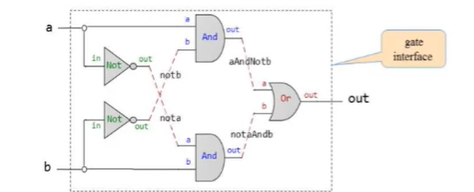

This notes all amazing things I've learned from [Nand2Tetris](https://www.coursera.org/learn/build-a-computer).

_"The Nand to Tetris course takes you on a self-paced fascinating voyage of discovery in which you will go all the way from Boolean algebra and elementary logic gates to building a Central Processing Unit, a memory system, and a hardware platform, leading up to a general-purpose computer that can run any program that you fancy."_

[Module 1: Boolean Functions and Gate Logic](#Module-1:-Boolean-Functions-and-Gate-Logic)

# Module 1: Boolean Functions and Gate Logic

- A brief introduction of Boolean algebra, how Boolean functions can be physically implemented using logic gates.
- How to specify gates and chips using a  HDL
- How to simulate the behaviour of the resulting chip specifications using hardware simulator.

## Boolean logic

- Boolean Algebra: true/false. 1/0, yes/no, on/off



## Boolean Functions Synthesis
- Boolean function: function that operates on binary inputs and returns binary outputs.
- Any Boolean function can be represented using an expression containing AND and NOT operations.
- NAND function: Any Boolean function can be represented using an expression containing only NAND operations.
```
NOT(x) = (x NAND x)
x AND y = NOT(x NAND y)
```

## Logic gates
- A _gate_ is physical device that implements a Boolean function. The complex gates are composed from more elementary gates. Most gates are implemented as transistors etched in silicon, packaged as chips.
```
If a Boolean function f operates on n variables and returns m binary results, the gate that implements f will haven input pins and m output pins. When we put some values v1...vn in the gate’s input pins, the gate’s ‘‘logic’’—its internal structure—should compute and output f(v1...vn).
```
- Gate logic (also call logic design - the art of interconnecting gates in order to implement more complex functionality): a technique for implementing Boolean functions using logic gates.
--> What want to do: Given a gate specifications (interface), find an efficient way to implement it using other gates that are already implemented.


- Circuit implementations



## Hardware Description Language (HDL)

__HDL is functional/ declarative language__: a formalism for defining chips; objects whose interfaces consist of input and output pins what carry binary signals, and whose implementations are connected arrangements of other, lower-level, chips.

- __Design: from requirements to interface__


Idea:
- - out=1 when: (a AND NOT(B)) OR (b AND NOT(a))
- - Find possible diagrams. For example:

- Design: from gate diagrams to HDL




```HDL

/**
    Xor gate: out = (a AND NOT(b)) OR (NOT(a) AND b)
*/

CHIP Xor {
    INT a, b;
    OUT out;

    PARTS:
    NOT (in=a, out=not(a));
    NOT (in=b, out=not(b));
    AND (a=a, b=not(b), out=aAndNot(b));
    OR (a=aAndNot(b), b=notaAndb, out=out);
}

```


## Multi-bit versions of basic gates
- Multi-bit arrays: busess (computer hardware is designed to operate on busses. _For example, a basic requirement of a 32-bit computer is to be able to compute (bit-wise) an And function on two given 32-bit buses_ )
- 