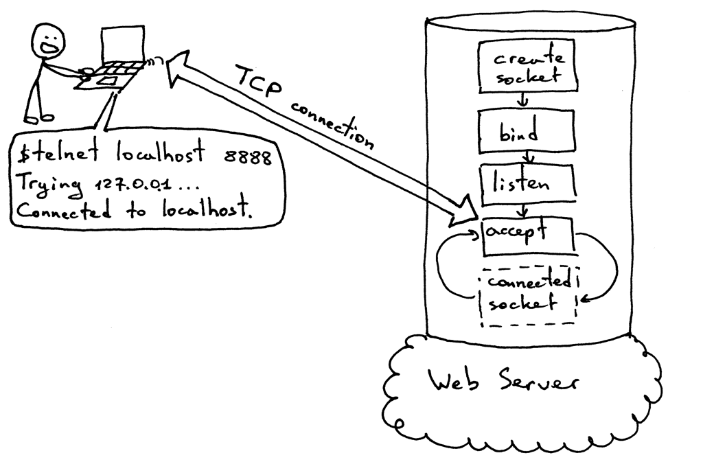
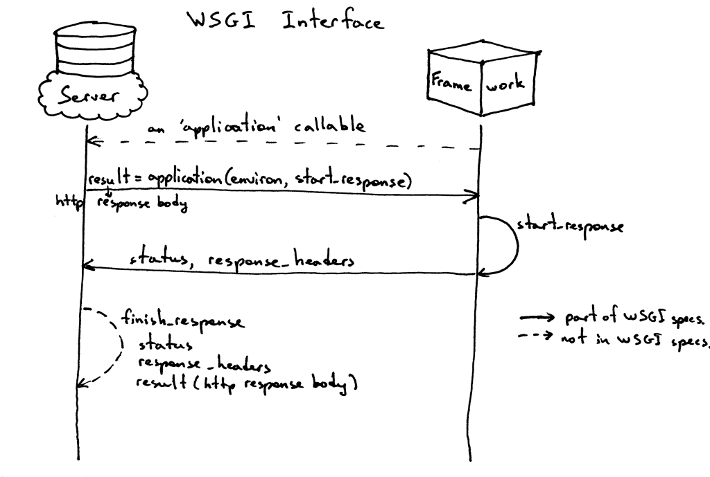
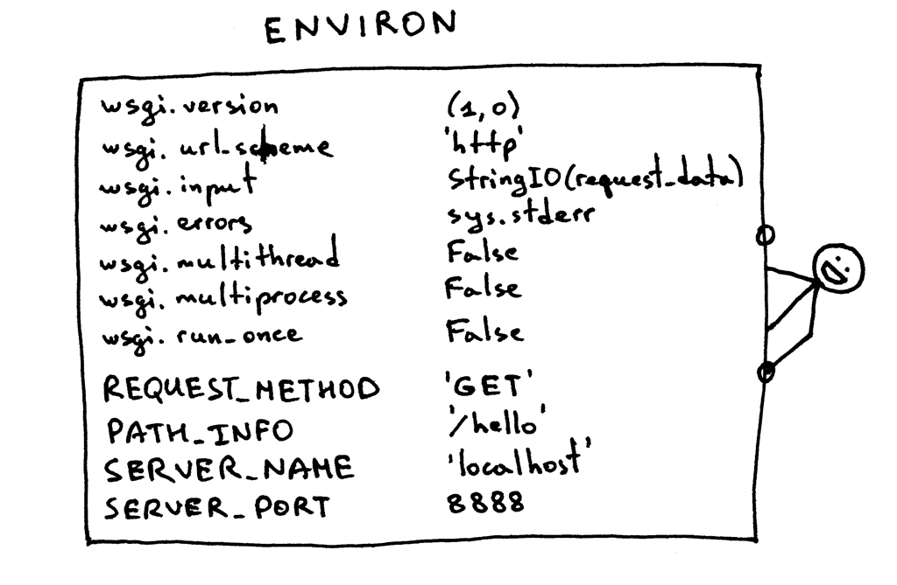

# WEB SERVER

_This notes from the course [Let's Build A Web Server](https://github.com/rspivak/lsbaws)_

## What it is
It's a networking server that __sits on a physical server__ and __waits for a client to send a request__.
When it receives a request, it __generate a response__ and sends it back to the client.
The communication between a client and a server happends using HTTP protocol.

## How it works
The Web server __creates a listening socket__ and starts __accpeting new connections in a loop__.
The client initiates a TCP connection and after successfully establishing it, the client sends an HTTP request to the server and the server responds with an HTTP response that gets displayed to the user. To establish a TCP connection both clients and servers use sockets.

### Socket
An abstration of a communication endpoint and it _allows programs to communicate with another program using file descriptors_.

Socket pair fpr a TCP connection is a 4-tuple that identifies two endpoints of the TCP connection: _local IP address, local port, foreign IP address, foreign port_

Server socket creation sequence: socket, bind, listen, accept
Client connection creattion sequence: socket, connect
### WSGI interface
There's an interface which make sure we can run our Web server with multiple Web frameworks without making code changes either to the Web server or to the Web frameworks. In python, the problem solved with __WSGI__ (java is __[Sevlet API](https://en.wikipedia.org/wiki/Jakarta_Servlet)__)

_See [code implemented](webserver2.py)_

__How WSGI interface works:__

- The framework provides an 'application' callable.
- The server starts and invokes the ‘application’ callable for each request it receives from an HTTP client.
- The server reads and parses a request.
- The server builds a dictionary ‘environ’ using the request data.
- The server passes a dictionary ‘environ’ containing WSGI/CGI variables and a ‘start_response’ callable as arguments to the ‘application’ callable.

- The framework/application generates an HTTP status and HTTP response headers and passes them to the 'start_response' callable to the server to store them. The framework/application also returns a response body.
- The server combines the status, the response headers, and the response body into an HTTP response and transmits it to the client.

### Process
The instance of a computer program that is being executed by one or many threads
### File descriptor
File descriptor: a non-negative integer that the kernel returns to a process when it opens an existing file, creates a new file or when it creates a new socket.

[File descriptor explained](https://stackoverflow.com/questions/5256599/what-are-file-descriptors-explained-in-simple-terms)

By default, UNIX shells assign file descriptor 0 to the standard input of a process, file descriptor 1 to the standard output of the process and file descriptor 2 to the standard error.

### PID and PPID
In Linux, an executable stored on dishk is called a program, and a profram loaded into memoty and running is called a process.
When a process is started, it is given a unique number called process ID (PID) that identifies that process to the system.

## Bonus
### __Web service__
The purpose serves to communicate between different software applications.

Web services include any software, application, or cloud technology that __provides standardized web protocols (HTTP or HTTPS)__ to interoperate, communicate, and exchange data messaging – usually XML (Extensible Markup Language) – throughout the internet.

Web service comprises these essential function:
- Available over the internet oe intranet networks.
- Standardized XML messaging system.
- Independent of a single operating system or program language.
- Self-describing via standard XML language.
- Discoverable through a simple location method.

_All web services can be APIs, but not all APIs can be web services_
## Source

- [Web service explained](https://www.cleo.com/blog/knowledge-base-web-services)