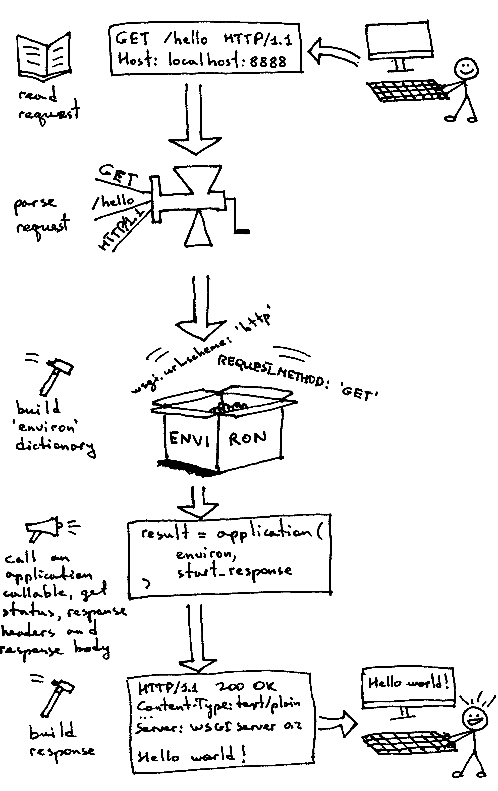

<b>WEB SERVER</b>

_This notes from the course [Let's Build A Web Server](https://ruslanspivak.com/lsbaws-part3/)_

# What it is
It's a networking server that __sits on a physical server__ and __waits for a client to send a request__.
When it receives a request, it __generate a response__ and sends it back to the client.
The communication between a client and a server happends using HTTP protocol.

# How it works
The Web server __creates a listening socket__ and starts __accpeting new connections in a loop__.
The client initiates a TCP connection and after successfully establishing it, the client sends an HTTP request to the server and the server responds with an HTTP response that gets displayed to the user. To establish a TCP connection both clients and servers use sockets.

There's an interface which make sure we can run our Web server with multiple Web frameworks without making code changes either to the Web server or to the Web frameworks. In python, the problem solved with __WSGI__ (java is __[Sevlet API](https://en.wikipedia.org/wiki/Jakarta_Servlet)__)

_See [code implemented](webserver2.py)_

How WSGI interface works:

- The framework provides an 'application' callable.
- The server starts and invokes the ‘application’ callable for each request it receives from an HTTP client.
- The server reads and parses a request.
- The server builds a dictionary ‘environ’ using the request data.
- The server passes a dictionary ‘environ’ containing WSGI/CGI variables and a ‘start_response’ callable as arguments to the ‘application’ callable.

- The framework/application generates an HTTP status and HTTP response headers and passes them to the 'start_response' callable to the server to store them. The framework/application also returns a response body.
- The server combines the status, the response headers, and the response body into an HTTP response and transmits it to the client.

